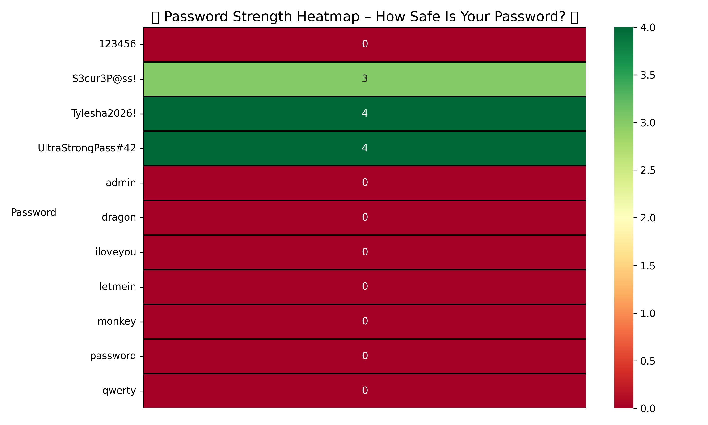

# Password Heatmap 🔥

Ever wonder **how weak or strong your passwords really are**?  
I built a quick **Password Strength Heatmap** in Python to find out… and yes, it’s kind of scary 😅.



🎥 Watch the demo here: [Loom Demo](https://www.loom.com/share/1397194ab166419085128152d19068c3)

---

## How it works
1. The Python script `password_heatmap.py` takes a list of passwords.
2. Uses `zxcvbn` to calculate password strength.
3. Generates a **colorful heatmap** using `seaborn`:
   - 🔴 Red = weak  
   - 🟡 Yellow = medium  
   - 🟢 Green = strong

---

## Why it’s fun
- Quickly visualize password safety.  
- Challenge your friends to see who’s living dangerously online.  
- Perfect for showing off Python skills + data visualization.  

---

## Try it yourself
Clone the repo and run:

```bash
python3 password_heatmap.py
